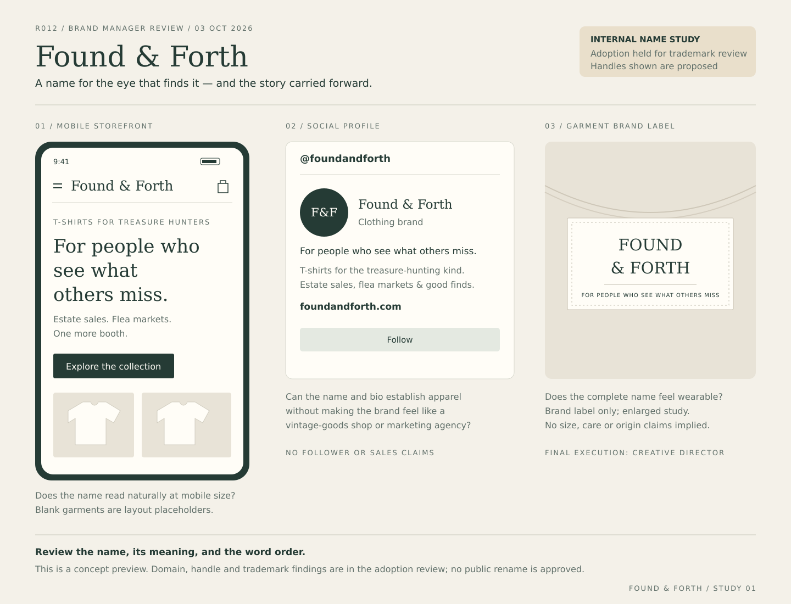

# Found & Forth — adoption review

## Current decision — October 3, 2026, later Founder discussion

**Paid work on Found & Forth is paused. Naming is reopened with conflict avoidance as an early filter.** This supersedes the earlier recommendation below to obtain a fixed-fee quote. No attorney/search service engagement is authorized. The Founder prefers considering another name rather than paying to resolve this candidate's uncertainty. Found & Forth remains a reference candidate, not the active adoption recommendation; the FOUND record is an unresolved screening concern, not an adjudicated legal blocker.

**Positioning hypothesis — exact approved wording:** Found & Forth makes apparel for people who spot overlooked character and carry the story forward, beginning with antique and vintage treasure hunters.

**Working customer-facing line — approved for preservation and further development:** For people who find things. And reasons to keep them.

The positioning and working line survive the name change. The Founder confirmed that the name felt right in all three visual contexts and strongly preferred this line over “For people who take ‘just looking’ seriously.” The original visual study below is retained as historical evidence and still displays the superseded line. The updated [R012 brand brief](R012-Antiques-Treasure-Hunters-Brand-Hypothesis-Brief.md) governs future creative development; [the shortlist](R012-Brand-Renaming-Shortlist.md) governs the reopened naming process.

No purchase, filing, account change, or public rename was performed. Worth the Detour remains the working MVV brand. Attorney involvement was a recommendation for this specific risk question, not a requirement to run a public-source search.

---

## Archived review — before the later Founder decision

All recommendations and “review now” instructions below describe the earlier checkpoint and are superseded by the current decision above.

## Decision in one minute (historical)

**Found & Forth is the Founder-approved lead candidate for the next checkpoint. It is not an adopted or cleared brand.**

**Updated disposition: Potential blocker — deeper review required.** Today's direct USPTO follow-up identified a live standard-character **FOUND** registration covering T-shirts and online apparel retail. Sharing a word does not itself establish infringement or refusal, but the overlapping goods make this a material question that the earlier exact-name screening did not resolve. Obtain a targeted U.S. trademark opinion on the complete **Found & Forth** name before adoption or commercial rollout.

This supersedes the earlier October 3 assessment, “Clear enough to advance, conditionally,” for adoption purposes. The domain and handle evidence is still useful; it is not trademark clearance.

**Review now:** the name-in-context preview, the new trademark finding, and whether the name merits a bounded professional review. **Recommended:** retain the candidate provisionally and get a fixed-fee scope/quote for that review. No purchase, account creation, public rename, trademark filing, or paid engagement is authorized by this document.

## 1. Proposed brand meaning

**Positioning hypothesis:** Found & Forth makes apparel for people who spot overlooked character and carry the story forward, beginning with antique and vintage treasure hunters.

**Retain the existing customer-facing line:** For people who see what others miss.

“Found” supplies discovery and the hunter's eye. “Forth” supplies movement and continuity: a find has another chapter with its next keeper. This is a Brand Manager interpretation to test, not demonstrated customer comprehension. The name may initially sound like a vintage shop or creative studio; apparel imagery and an explicit T-shirt descriptor must establish what we sell.

The initial customer remains the repeated estate-sale, flea-market, antique-mall and vintage hunter. Recognition of their eye and hunt behavior remains the central promise. Preserve curiosity, dry humor and delight without implying appraisal expertise, luxury connoisseurship, sustainability certification, or that the new shirts themselves are vintage.

| Community | Plausible connection | Boundary |
|---|---|---|
| Antique/vintage hunters | Seeing overlooked worth; the story of a find | Launch wedge; apparel category must be obvious |
| Old-house restoration | Recognizing character worth carrying forward | Future hypothesis, not a new launch assortment |
| Sea-glass collectors | A practiced eye and the story of discovery | Do not invent provenance or encourage harmful collecting |
| Record diggers | Finding a pressing, artist or forgotten recording | Preserve insider specificity; no unlicensed artist imagery |

These are brand-fit hypotheses, not validated demand or approval to expand the opportunity order.

## 2. Name-in-context preview

[Open the vector preview](assets/found-and-forth/Found-and-Forth-Name-Study.svg).

Three deliberately simple contexts: mobile storefront header, social profile, and garment brand label. This is a typographic name study for the checkpoint, not a final identity system, product design, live storefront, or approved manufacturing label. The handle and domain shown are proposed. Final creative execution remains with the Creative Director.

**What to review:**

1. Can you read and remember the complete name quickly, including word order?
2. Does the storefront say “T-shirts for treasure hunters” clearly enough?
3. Does the full name feel wearable on a small label without shortening it to FOUND?
4. Does the discovery/continuity meaning fit the launch wedge and the proposed adjacencies?

Use the complete name consistently during evaluation. Do not treat typography, an ampersand, or adding “& Forth” as a proven solution to the trademark question.

## 3. Direct availability evidence

Observed October 3, 2026, America/Chicago. Public profile observations were made earlier in the same review session; the registrar result was re-opened during package preparation. “Not found” is a public-page response, not confirmed claimability. No account-setting changes were made.

| Asset | Observed result | Evidence / continuation |
|---|---|---|
| foundandforth.com | Available for standard registration; price and Add to cart displayed | [Exact Namecheap search](https://www.namecheap.com/domains/registration/results/?domain=foundandforth.com) |
| Instagram @foundandforth | Profile isn't available | [Exact URL](https://www.instagram.com/foundandforth/) |
| TikTok @foundandforth | Couldn't find this account | [Exact URL](https://www.tiktok.com/@foundandforth) |
| Facebook @foundandforth | Redirected to login; unverified | [Observed login redirect](https://www.facebook.com/login/?next=https%3A%2F%2Fwww.facebook.com%2Ffoundandforth) |
| YouTube @foundandforth | Page unavailable | [Exact URL](https://www.youtube.com/@foundandforth) |
| X @foundandforth | Page does not exist | [Exact URL](https://x.com/foundandforth) |
| Pinterest @foundandforth | Requested profile redirected to generic homepage/error; unverified | [Observed destination](https://www.pinterest.com/?show_error=true) |
| Etsy FoundAndForth | Shop page not found | [Exact shop URL](https://www.etsy.com/shop/FoundAndForth) |

**Signed-in check outcome:** the accessible browser surfaces are logged out. Facebook explicitly requires login; Instagram and TikTok expose no claimability checker in their public responses. No signed-in validator was reached, so exact Instagram/Facebook/TikTok claimability remains open. At the later acquisition step, use the correct Taukay-controlled account and stop before saving any rename until migration is approved. If a platform reveals availability only when claiming the name, treat the claim as a separate authorized acquisition action rather than pretending a read-only check is possible.

**Handle policy proposed for approval:** prefer @foundandforth consistently. If a priority platform rejects it, evaluate one consistent fallback, @wearfoundandforth, across Instagram/Facebook/TikTok. That fallback has NOT been checked or approved; do not silently substitute it. Optional platforms need not delay the initial Meta-led test.

For comparison, Once & Still's exact Instagram and X handles are occupied. The X profile links onceandstill.com and describes Christian blogging/artwork; its Etsy shop route redirects to an existing person profile. Those findings do not establish an apparel conflict but remove its previous clean-handle advantage. Sources: [Instagram](https://www.instagram.com/onceandstill/), [X](https://x.com/onceandstill), [Etsy redirect destination](https://www.etsy.com/people/2015jonesfrances).

## 4. Trademark and commercial findings

### New material record

| Field | Official USPTO result |
|---|---|
| Wordmark | FOUND |
| Serial / registration | 99242207 / 8116656 |
| Owner | Profound Aesthetic LLC |
| Status | Live / Registered; January 27, 2026 |
| Form | Standard characters |
| Classes | 018, 025, 035 |
| Relevant goods/services | T-shirts and other apparel; online retail featuring apparel and accessories |
| Primary evidence | [Direct USPTO record](https://tmsearch.uspto.gov/search/search-results/99242207) |

The official record was read directly, including status, owner, standard-character claim and goods/services. Its apparel overlap is more relevant to our adoption decision than the marketing agency alone. This is a screening finding, not a conclusion that the complete proposed name is legally unavailable.

### Reproducible query log

In [USPTO Trademark Search](https://tmsearch.uspto.gov/search/search-results), enter the following using **Field tag and Search builder**, submit with Enter, and wait for the result. The search-results URL does not preserve the query. No class restriction was applied to the field-tag queries.

| Query / mode | Observed response on October 3 |
|---|---|
| `CM:"found and forth"` | No results found |
| `CM:(found AND forth)` | No results found; checks the two words in either order |
| `CM:("found & forth" OR "forth & found" OR foundandforth OR forthandfound)` | No results found |
| `SN:99242207` | One detailed record: FOUND; live registration described above |

The initial basic **Wordmark** query `"found and forth"` expanded to 1,477 results, including separate FOUND and FORTH marks. It was not an exact-phrase result and is NOT counted as a clean exact-name screen. Its first results also exposed FOUND. serial 99946550 (live/pending; retail clothing), FOUND serial 99149259 (live/pending; apparel/footwear), and FORTH serial 98222894 (dead/abandoned; apparel). These additional cards were seen in the results list, not separately analyzed; include them in a professional review, not as adjudicated conflicts.

Earlier conversation history reports a no-exact-live-mark knockout, but supplied no original queries or record export. Today's direct field-tag checks provide the reproducible evidence. This remains a bounded screen, not an exhaustive phonetic, common-law, international, or legal clearance search.

### Existing reverse-name concern

[Forth & Found](https://www.forthandfound.com/) offers growth-marketing services. [FORTH & FOUND LTD, company 16756734](https://find-and-update.company-information.service.gov.uk/company/16756734) is listed as active with advertising-related activities. Their relationship is unverified. Keep the brand-memory/search confusion concern distinct from the question of trademark rights in apparel.

Direct Bing searches for [“Found & Forth”](https://www.bing.com/search?q=%22Found+%26+Forth%22) and [“Once & Still”](https://www.bing.com/search?q=%22Once+%26+Still%22) did not reveal a confirmed exact-name apparel business in inspected results. Google blocked the cloud browser with an unusual-traffic notice; Bing and search-service results were used. Lack of an exact-name result does not negate the FOUND record.

USPTO guidance explains that marks can be confusingly similar without being identical and that related goods/services matter. We therefore cannot infer clearance from the extra words or separate industry of one known business. [Source: USPTO likelihood of confusion](https://www.uspto.gov/trademarks/search/likelihood-confusion).

### Targeted question for professional review

Assess use and registration of **FOUND & FORTH / FOUND AND FORTH** in the U.S. for T-shirts, related apparel, and online apparel retail. Compare the full mark's commercial impression against FOUND registration 8116656 and relevant pending/common-law uses, and consider reversed Forth & Found usage. Request a written proceed/caution/avoid recommendation, material limitations, and a fixed-fee quote before engagement. No attorney has been contacted and no fee is estimated as fact.

## 5. Proposed acquisition list and budget

**Planning only; on hold pending the trademark disposition and Founder authorization.**

| Item | Proposed scope | Current price evidence / budget |
|---|---|---|
| foundandforth.com | One year at Namecheap; standard domain only | Published USD first-year sale $11.28, or $6.79 if eligible for NEWCOM679; $0.20 ICANN fee plus any tax. Approximate pretax totals $11.48 or $6.99. Renewal currently $18.48 plus fee, or $18.68 pretax. Proposed initial all-in cap: **$20**, not yet authorized. |
| Instagram/Facebook/TikTok handles | Exact handle where claimable; preserve existing Meta business assets | No paid username, verification plan or subscription proposed; $0 purchase budget. Account claimability unresolved. |
| YouTube/X/Pinterest | Optional reservations after core accounts | $0 purchase budget; no third-party handle purchase |
| Etsy | Defer until Etsy is selected as a sales channel | No shop creation or listing fees authorized |
| Trademark review | One bounded written assessment | Fee unknown; obtain scope/quote for approval |

Sources: [exact domain result](https://www.namecheap.com/domains/registration/results/?domain=foundandforth.com) and [official .com price table and fee disclaimer](https://www.namecheap.com/domains/registration/gtld/com/), retrieved October 3. Domain-specific browser pricing displayed EUR; the USD amounts above come from the official U.S.-dollar page retrieved separately. These are not a completed checkout quote. Recheck availability, coupon eligibility, fees, tax and renewal price before any transaction. No hosting, email trial, paid DNS, SSL add-on, alternate domains, or multi-year registration is proposed.

## 6. Concrete Founder checkpoint

| Decision | Recommendation now | What would constitute approval |
|---|---|---|
| Brand fit | Retain Found & Forth provisionally | Approve meaning and name-in-context direction, or identify the specific concern |
| Trademark next step | Get a scoped quote for targeted review | Select reviewer and approve fee separately; this package is ready to provide as background |
| Domain/account acquisition | Hold | Approve exact assets and budget only after risk is resolved or consciously accepted |
| Public rename | Hold | Separate approved migration checklist after acquisition |

**Recommended next step:** review the name study and decide whether this candidate is worth the targeted trademark review. The package is complete for that decision; it is not an adoption pass. If the review advises against use or is not worth the expense, return to a narrow naming round rather than automatically adopting Once & Still or an older red-flagged candidate.

## 7. Transition outline after adoption approval

1. Secure approved assets under Taukay LLC's established administration and record ownership privately.
2. Coordinate with the Campaign Operator on existing Facebook/Instagram assets. Prefer continuity of the current assets where platform rules allow; do not create duplicate Meta assets by default.
3. Have Creative Director finalize the identity and approve the updated storefront/social execution.
4. Have Technical Lead prepare customer-facing name/domain changes, redirects and a migration date. Preserve historical WTD campaign names, IDs, source-design IDs and measurement records; use an explicit mapping instead of rewriting history.
5. Technical Reviewer checks redirects and attribution, including query preservation and an acquisition/product mismatch test. Founder reviews the actual preview before production changes.
6. Publish only after explicit rollout approval and record the effective date for analytics interpretation.

No current campaign-state assumption is made here. Re-read issue #56 and live state before scheduling any transition. Current live MVV branding remains Worth the Detour until that later decision.

## 8. Decision history and internal sources

- September 14 repository shortlist: Drift & Keep led the earlier naming round.
- October 3 Founder instruction: move Found & Forth ahead of Once & Still for the next checkpoint; then prepare this package.
- October 3 follow-up: verified FOUND apparel registration; adoption recommendation changed to potential blocker / targeted review required. Founder has not yet reviewed this new finding.
- [Existing R012 brand hypothesis](R012-Antiques-Treasure-Hunters-Brand-Hypothesis-Brief.md): hunter's eye, positioning line, voice, boundaries and adjacency constraints.
- [Brand Manager methodology](../company/Brand-Manager-Methodology.md): minimum viable naming screen; surface material conflicts; keep brand work bounded.
- [Updated shortlist](R012-Brand-Renaming-Shortlist.md): current candidate status with earlier records preserved.

Package verification: source links and serial numbers checked; public absence distinguished from claimability; visual study rendered and inspected; no purchases, account mutations, paid engagements or public rollout performed.
